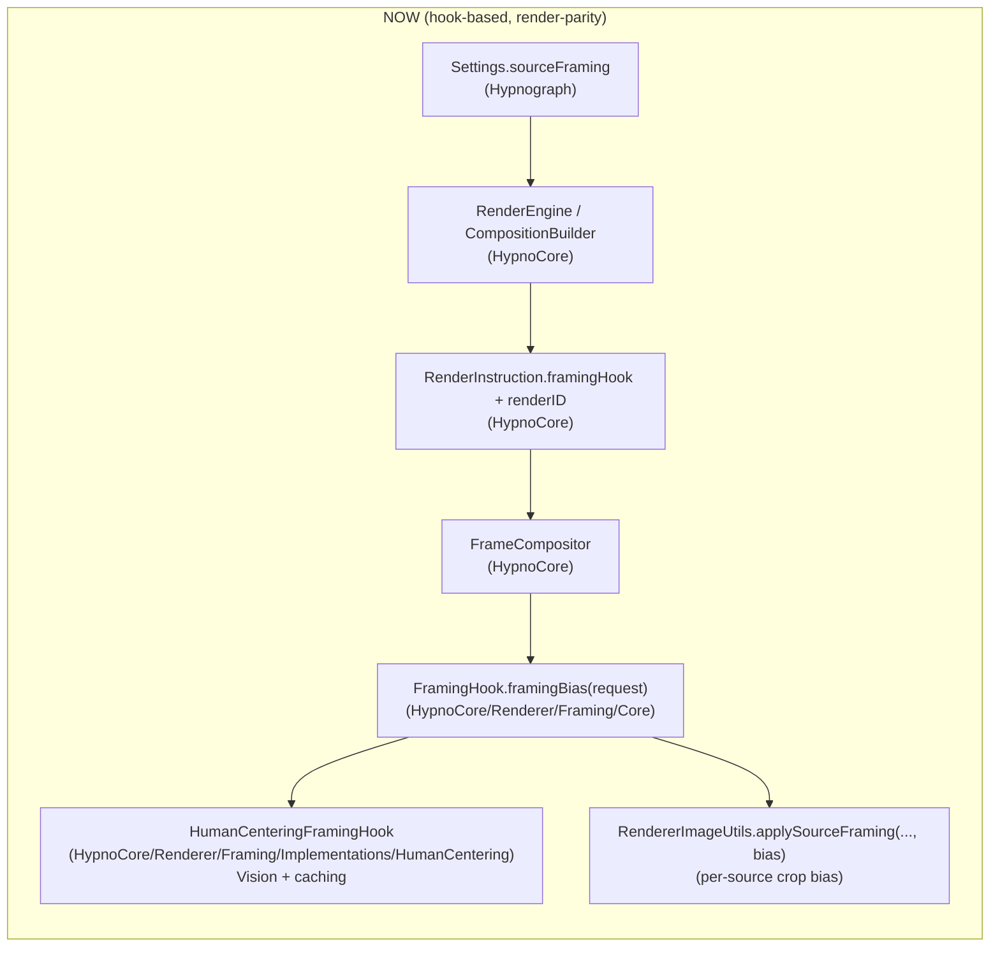
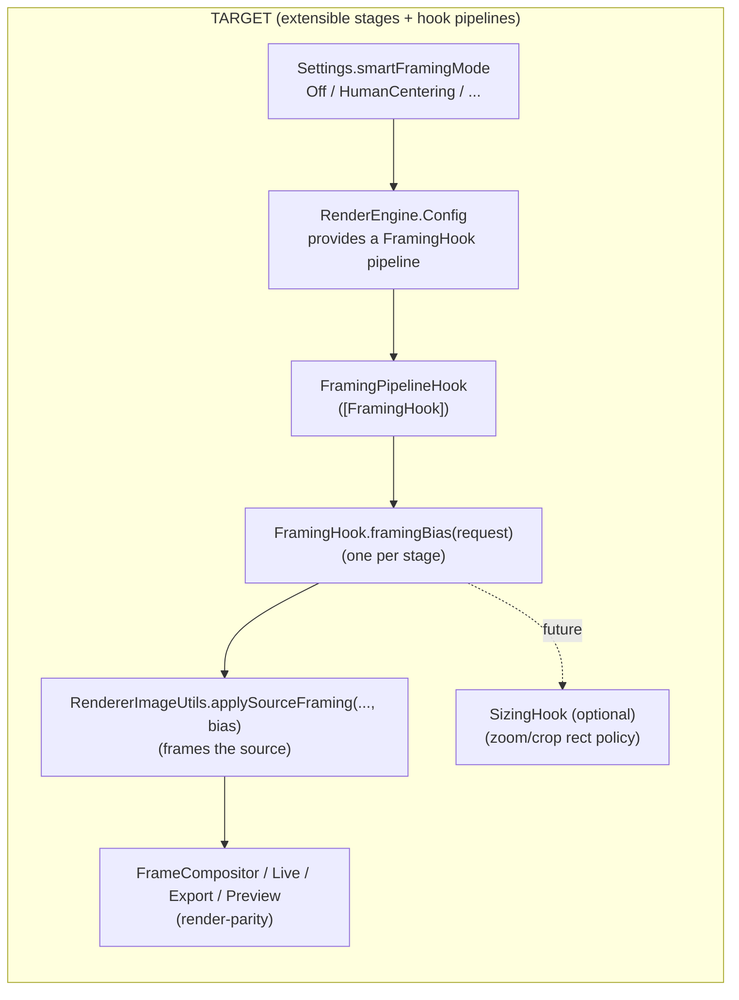

# Smart Framing (Human Centering): Overview

Goal: when a *source* is being mapped into the **output frame** (via `SourceFraming.fill`), detect a human (face/body) and bias the crop so the subject stays comfortably in-frame (head visible, body preferred) **without revealing empty edges**.

This is primarily a **framing/cropping** concern, not an effect, and should be expressed as a **render pipeline hook** so the implementation is optional, swappable, and well-contained.

Non-goal: a display/window-global “smart framing” layer. If we do anything that changes framing over time (“monitoring” / re-centering), it must happen in the same render path used by Preview *and* Export so what you see is what you render.

## Why this project exists

Today, many sources are portrait-oriented (or portrait-like compositions) but displayed in a landscape output. `fill` cropping often defaults to “center crop”, which frequently cuts off heads or frames subjects awkwardly.

Desired behavior:
- If a subject is detected and there is slack on an axis after scaling (usually vertical slack in portrait→landscape), shift the crop to keep the head in-frame and show more body.
- Prefer stable behavior (no jitter) and predictable bounds (no blank edges).
- Work for still images and videos

## Current status (what exists today)

Smart framing is implemented as a **render-parity** system:

- A `FramingHook` runs in the compositor for per-source `SourceFraming.fill`.
- The default `HumanCenteringFramingHook` uses Vision-based detection and caches results per render session/time bucket.
- Preview and Export share the same framing decision path (no preview-only display/window framing).

## Dolphin Diagrams

### NOW (hook-based, render-parity)

### TARGET (extensible stages + hook pipelines)

## What’s wrong with the current shape (why it shouldn’t merge yet)

Remaining work is primarily productization/tuning rather than architecture:
- Expose an explicit enable/disable surface (setting/flag) if this should not be “always on”.
- Decide/tune sampling cadence for video time buckets (currently designed for frequent sampling).
- Performance guardrails: keep analysis downscaled and caching bounded; verify multi-layer cases.

## Target architecture (what we want before merging)

Introduce a framing hook layer in `HypnoCore/Renderer` similar in spirit to the Effects subsystem, but tailored to cropping decisions:

- `HypnoCore/Renderer/Framing/Core/`
  - `FramingRequest` (inputs: source framing mode, output size/aspect, source extent/transform, time, sourceIndex, etc.)
  - `FramingBias` (outputs: anchor/bounds + axis preferences, headroom, target position)
  - `FramingHook` protocol + default no-op implementation
  - A small registry/wiring surface (either per-render config or a renderer-scoped shared hook)
- `HypnoCore/Renderer/Framing/Implementations/HumanCentering/`
  - Vision integration, heuristics/tuning, and caching (entirely self-contained)

Renderer integration should become a single call-site:
- `FrameCompositor` (or `RendererImageUtils.applySourceFraming(...)`) asks for an optional `FramingBias` and applies it during *per-source* `fill` crop translation.

If we keep any time-varying behavior (“monitoring” / re-centering for video), it must be:
- implemented inside the `FramingHook` (time-aware request → bias), and
- applied in the compositor so **Preview, Live, Export** all use the same logic.

The display layer (`PlayerView.contentFocus`) should not be part of smart framing, since it cannot be export-parity.

## “Definition of ready to merge”

Before merging to `main`, we want:
- A `FramingHook` API that is generic (not human-specific) and can support future framing policies.
- Human centering implemented entirely inside `Framing/Implementations/HumanCentering`.
- Minimal touchpoints in the renderer (ideally 1–2 call sites).
- Clear enable/disable surface (setting/flag) and predictable defaults.
- Basic performance guardrails (downscaled analysis, caching) and safe fallbacks.
