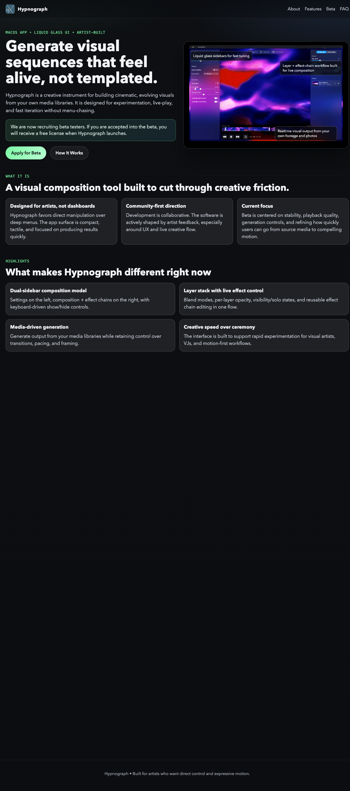

  

# Hypnograph

Hypnograph is a memory-forward visual instrument for macOS.

Instead of browsing your archive like a filing cabinet, Hypnograph replays your photos and videos as evolving, remixable sequences. The product goal is to make revisiting your captured life feel exploratory, reflective, and creatively useful.

If you're joining as a developer collaborator: this is an app for generative playback, effect-driven transformation, live visual experimentation, and export of resulting "hypnograms."

The app currently centers on:
- Generative playback and sequencing of local media
- Effect-chain based visual processing (Core Image + Metal)
- Playback, live preview, and export workflows

## Tech Snapshot

- Platform: macOS 14+
- Language/UI: Swift 5.9+, SwiftUI + AppKit
- Core frameworks: AVFoundation, CoreImage, Metal, Photos
- Build tool: Xcode project (`Hypnograph.xcodeproj`)

## Quick Start (Dev)

1. Open [Hypnograph.xcodeproj](/Users/lorenjohnson/dev/Hypnograph/Hypnograph.xcodeproj) in Xcode 15+.
2. Select the `Hypnograph` scheme.
3. Build and run on macOS.

Website draft/dev preview:
1. `cd /Users/lorenjohnson/dev/Hypnograph/website/hypnograph`
2. `docker compose up -d`
3. Open `http://localhost:8080`

## Repository Layout

- App source: [Hypnograph](/Users/lorenjohnson/dev/Hypnograph/Hypnograph)
- App tests: [HypnographTests](/Users/lorenjohnson/dev/Hypnograph/HypnographTests), [HypnographUITests](/Users/lorenjohnson/dev/Hypnograph/HypnographUITests)
- Website draft: [website/hypnograph](/Users/lorenjohnson/dev/Hypnograph/website/hypnograph)
- Project documentation: [docs](/Users/lorenjohnson/dev/Hypnograph/docs)

## Documentation Routing (Important)

All project docs must live in [docs](/Users/lorenjohnson/dev/Hypnograph/docs), and documentation work should follow [docs/README.md](/Users/lorenjohnson/dev/Hypnograph/docs/README.md).

Use this routing:
- Current work tracking: [docs/roadmap.md](/Users/lorenjohnson/dev/Hypnograph/docs/roadmap.md)
- Planned, not started: [docs/backlog](/Users/lorenjohnson/dev/Hypnograph/docs/backlog)
- Active project docs: [docs/active](/Users/lorenjohnson/dev/Hypnograph/docs/active)
- Completed project docs: [docs/archive](/Users/lorenjohnson/dev/Hypnograph/docs/archive) (filename format: `YYYYMMDD-project-name.md`)
- Completed roadmap items without dedicated project docs: [docs/archive/done.md](/Users/lorenjohnson/dev/Hypnograph/docs/archive/done.md)

If you're a collaborator or an LLM agent, start with [docs/README.md](/Users/lorenjohnson/dev/Hypnograph/docs/README.md) before creating or moving documentation.
