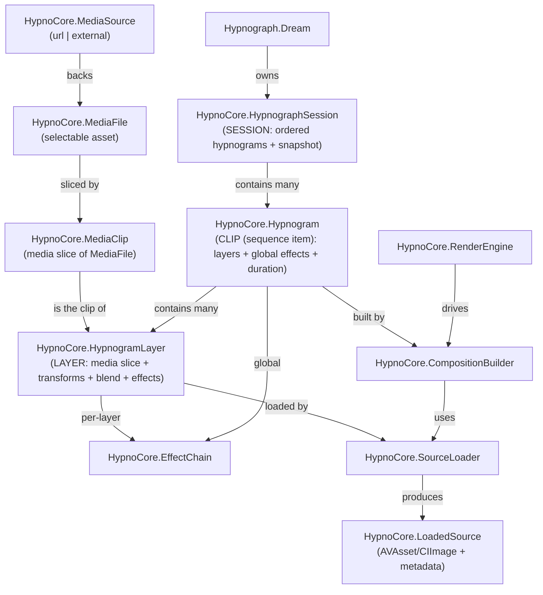
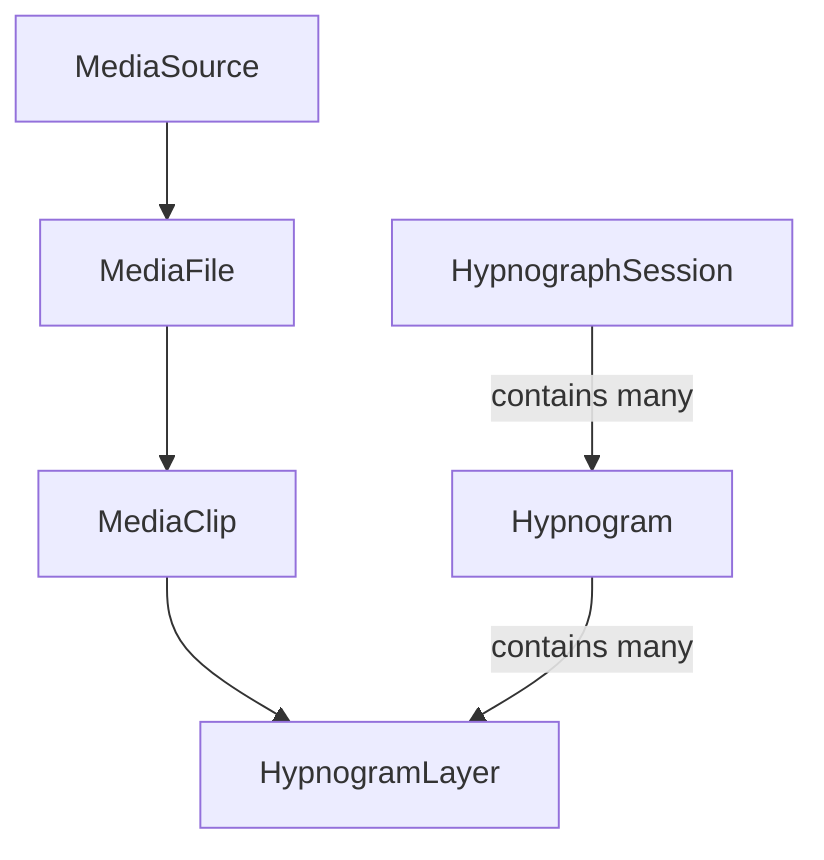

# Hypnograph Domain Diagram (Curated)

This is a curated, naming-oriented view of the core domain entities (media → recipe → render).

For the full, generated graph of *all* discovered Swift types and relationships, see:

- `docs/ontology/hypnograph-ontology.mmd` (filtered)
- `docs/ontology/hypnograph-ontology-full.mmd` (full)
- `docs/ontology/types.json` (machine-readable)

## Vocabulary summary

Core domain nouns (implemented 2026-01-22):

- **HypnographSession** = sequence/container of playable items
- **Hypnogram** = one playable item (1..N layers)
- **HypnogramLayer** = one layer inside a hypnogram
- **MediaClip** = a time slice of a selected media asset

