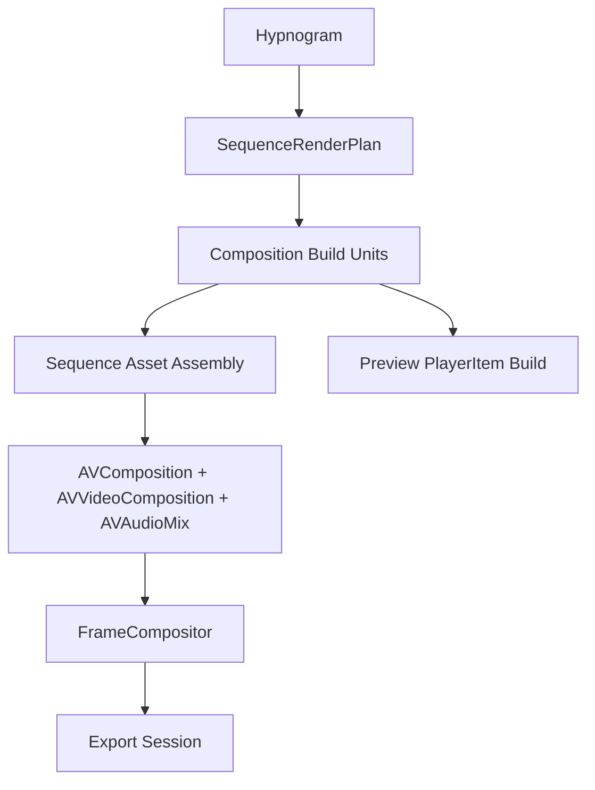

# Render Pipeline

Hypnograph has two render consumers built on the same composition renderer: preview playback and full-sequence export. Preview uses `AVPlayerItem` transport for interactive playback. Sequence export compiles the hypnogram into aligned sequence time, builds reusable composition render units at those aligned durations, assembles one final `AVComposition`, and lets the custom compositor resolve the correct frame for each sequence time.

Sequence export is driven by timing and spans, not by stitching together pre-rendered composition movies. Transition ownership, sequence-level effects, and audio timing stay inside one render model.

## Composition Rendering

The core primitive is composition rendering. `CompositionBuilder` builds a single composition into an `AVComposition`, an `AVVideoComposition`, optional `AVAudioMix`, and the render instructions the custom compositor needs. `FrameCompositor` resolves source frames, applies source framing, blends layers, applies layer effects, then composition effects, and finally any hypnogram-level effects attached through the current `EffectManager`.

That build path is used in three places:

- isolated preview and playback of one composition
- the outgoing and incoming material used during player-side composition transitions
- sequence export, where each composition is built once and then reused inside the larger sequence assembly

## Sequence-Time Export

`SequenceRenderPlan` is the canonical timing model for sequence export. It compiles the hypnogram into composition entries, boundary transitions, ordered spans, and frame-time samples. The plan resolves composition-owned transition settings with hypnogram defaults and compresses short adjacent transitions so a very short composition cannot demand more incoming plus outgoing overlap than it can contain.

`RenderEngine.makeSequenceBuild(...)` uses that plan plus the existing composition build path to create `CompositionBuildUnit`s. Those units are then assembled into one final export composition. Video tracks are pooled across non-overlapping spans so the final sequence does not explode into one track per source layer across the whole movie. Audio automation is applied at the sequence level so fades align to the resolved sequence transitions rather than to isolated composition exports.

At export time, the assembled `AVVideoComposition` uses `SequenceRenderInstruction`s derived from the plan’s ordered spans. `FrameCompositor` asks the plan what the current sequence time means. If the current sample is a composition body, it renders that composition at the correct local time. If the sample is a transition, it renders the outgoing and incoming compositions at their respective local times and applies the transition there. Sequence-level effects are then applied on top of the result.

## Preview Relationship

Preview uses an `AVPlayer`-based double-player handoff model for interactive playback and composition switching. Export uses the sequence-time plan. The composition renderer underneath those paths is shared, but the transport shell is not yet unified.

The same sequence-time model is the natural basis for:

- playhead-aware frame sampling
- sequence scrubbing
- better preview jumps and cuts
- eventually, a preview path that depends less on stitched `AVPlayerItem` rebuilding

## Current Limits

Preview and export still diverge at the transport layer, and export still leans on AVFoundation composition infrastructure rather than a fully custom frame scheduler and encoder. The important property of the current system is that timing and composition assembly are sequence-aware and reusable, which makes future playhead, scrubbing, and preview work build on the same model instead of inventing a second one.
